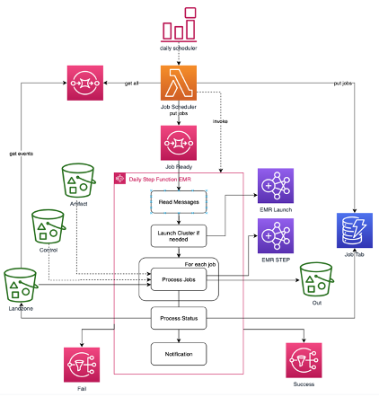

# Datamsk EMR launch 

*Deploy datamask-pyutil using EMR launch*

This project is a CDK stack to orchestrate the data-masking-framework. 



- [AWS Step functions](https://aws.amazon.com/step-functions): orchestrate the data pipeline
- [AWS Lambdas](https://aws.amazon.com/lambda): parse and process the S3 events
- [Amazon SQS](https://aws.amazon.com/sqs/): get the income events from  S3. 
- [Amazon SNS](https://aws.amazon.com/sns/): notify error or success 
- [Amazon EMR](https://aws.amazon.com/emr/): process the masking with Apache Spark
- [Amazon Dynamodb](https://aws.amazon.com/dynamodb/): store the history of processing.  
- [Amazon S3](https://aws.amazon.com/s3/):  store the income files, output files and parameters.

Deploy datamask-pyutil to run with pyspark in a S3 bucket.

- PREFIX: prefix name all the resources created.
- ENV: Define the environment, dev, prod or uat.
- ARTF_PARAM_FILE: The filename to the json parameter file.
- VPC: VPC id to create the EMR cluster
- SUBNET: Subnet id to create the EMR cluster
- AZ: Sybnet AZ id

The deploy.sh script get the version from the [emr-launch](https://github.com/awslabs/aws-emr-launch), python package that helps create the EMR cluster, and deploy the CDK dtamask-launch.
```
$ git clone [REPOSITORY PATH]
$ cd stacks/datamask-emr-launch
$ export PREFIX="org-prefix"
$ export ENV="dev"
$ export ARTF_PARAM_FILE="parm.json"
$ export VPC="vpc_id"
$ export SUBNET="subnet_id"
$ export AZ="az_id"
$ bash scripts/deploy.sh 

```
